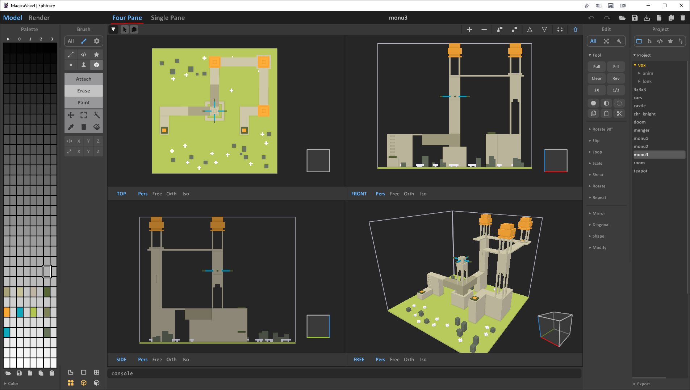
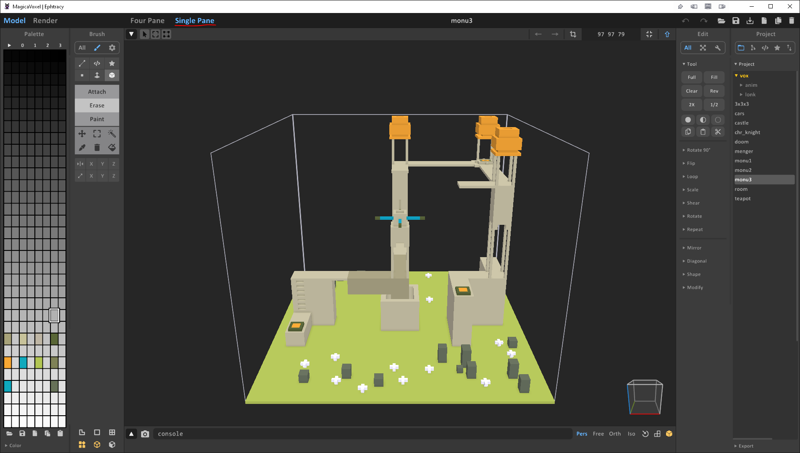

# MagicaVoxel 4-pane modeling mode

Configuration edit of MagicaVoxel 0.99.7.1 [5/29/2023] to enable a 4-pane modeling mode

---

## Installation

1. Download MagicaVoxel 0.99.7 [here](https://github.com/ephtracy/ephtracy.github.io/releases/download/0.99.7/MagicaVoxel-0.99.7.1-win64.zip) and extract it
2. Download this repository and extract it
3. Copy the `config` folder from this repository into the MagicaVoxel folder, overwriting the configuration files

---

## Usage

1. Once installed, MagicaVoxel will default to the Four Pane view upon starting.
2. At top of the window you will see a "Four Pane" tab and a "Single Pane" tab. You can quickly swap between the two here.

---

## Issues

This project is just shoving UI pieces around via the undocumented UI configuration files. Due to this there are a couple of issues you will run into that are outside of my control (as far as I can tell)

1. When you first open the Four Pane view all of the views will be extremely zoomed in. You will have to mousewheel over each of them to zoom out to a normal position.
2. The four panes will all show the same, default perspective when launched. I labeled each viewport TOP, SIDE, FRONT, FREE but you will have to click on the viewcube in each to snap the camera to the correct view. I recommend also setting each of them to Orthographic.

---

## Screenshots

#### 1. Four Pane View

#### 2. Single Pane View

---

## License

This project is licensed under the MIT License. See [LICENSE.md](LICENSE.md) for more details.

---

## Contact

For updates and inquiries, connect with me on Bluesky:

---

## Acknowledgments

- **Ephtracy** for creating and maintaining MagicaVoxel